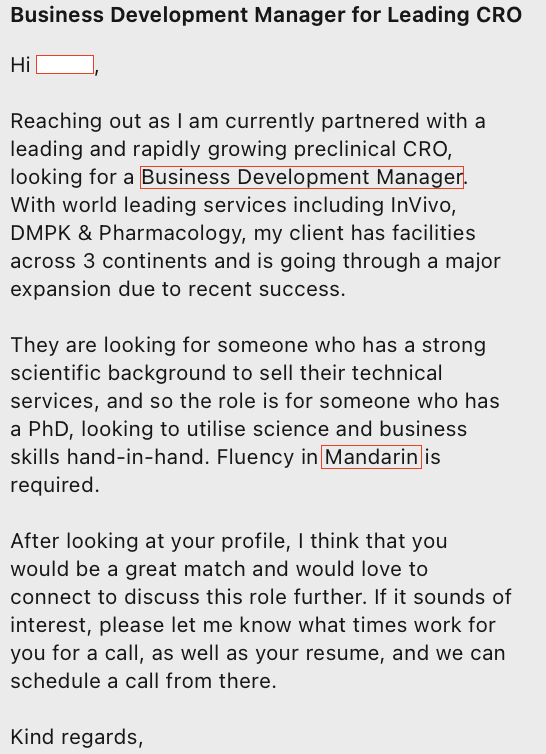

# 在欧洲当BD，华人身份是优势还是限制？

> 📅 **发布日期：2025 年 7 月 31 日**

最近，我收到了一家 CRO 公司猎头发来的消息：  
**他们在欧洲大力扩张 BD 团队，职位叫“Business Development Manager”，听起来很诱人。**

*图：CRO公司猎头发来的消息*

我看了下 JD，主要负责的是：

- 面向欧洲客户推广免疫肿瘤、动物模型、药效等技术服务  
- 远程办公，30% 出差  
- 底薪 55k 欧，提成后可达 85k 欧  

作为一个有科研背景、会中英德三语的技术人，这岗位对我来说确实有吸引力。

---

## 电话聊完，我开始“反向调研”这家公司

对方提到“团队多数是中国人”，我就在 LinkedIn 上查了下这家公司在欧洲的 BD 和 Licensing 团队成员。

结果让我挺惊讶的：  
🧾 **整个欧洲 BD 团队中，90% 以上都是中国人！**

几乎每个国家/城市的代表都是华人，包括德国、英国、瑞典、荷兰……

而且：

- 几乎都在最近 6–12 个月内加入  
- 很多是入门岗位，却统一冠名“BD Manager”  
- 大多没有本地语言背景  

---

## 我为什么犹豫了？

一开始我以为是“文化自卑”作祟。  
但后来我问了几个圈内朋友，他们也表示这种做法 **可能反而引起客户反感**。

### ❌ 从客户视角来看：
- 如果我是欧洲本地客户，看到所谓“本地团队”全是中国人，信任感真的会打折扣。
- 语言、沟通习惯不同，反而增加了商务合作的难度。

### ❓从公司组织角度来看：
- 用“华人BD”打下欧洲市场，听起来像 shortcut，但长期真的可持续吗？
- 招这么多 Manager，是为了“好听”？还是职位体系混乱？

---

## 我最终放弃了这个机会

不是因为害怕挑战，也不是不想转型，  
而是我觉得这个岗位 **title 虽高，结构却很虚**，团队策略也让我产生疑虑。

我更希望加入一个团队结构清晰、文化融合度高、可以真实学习和成长的环境，  
而不是被“Manager”这个名头吸引，却掉进一个无效增长的泥潭。

---

## 💬 想请教大家：

- 如果你是欧洲客户，看到这家公司“本地团队全是中国人”，你会怎么看？  
- 如果你是准备转型 BD 的技术人，会接受这样的团队吗？  
- “BD Manager”这个头衔，是加分项，还是职场通胀？

欢迎在评论区分享你的看法，也欢迎点赞+关注，继续了解

---

#### #BD岗位 #CRO公司 #海外华人职场 #德国找工作 #技术人转型 #博士转行 #猎头经验分享 #LinkedIn找工作 #职场观察笔记
