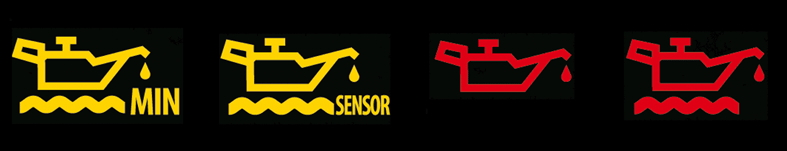
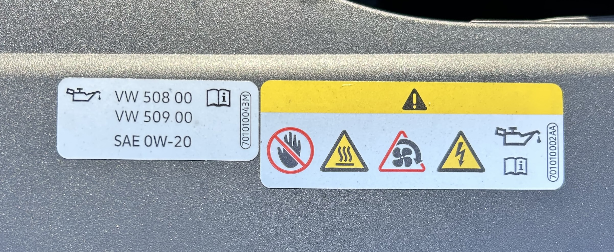
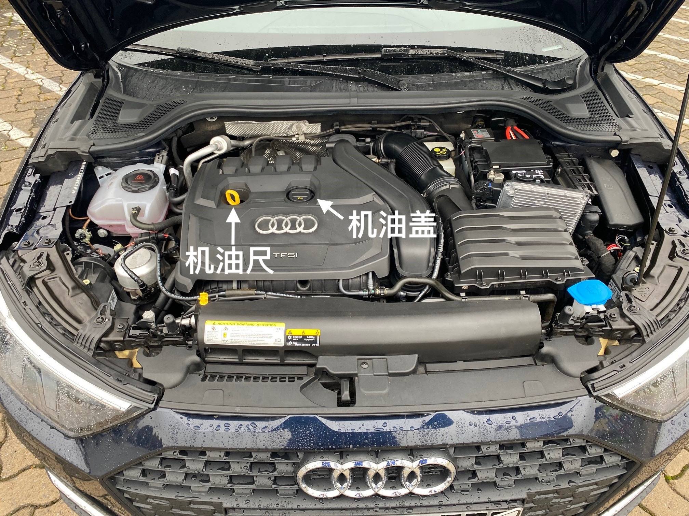
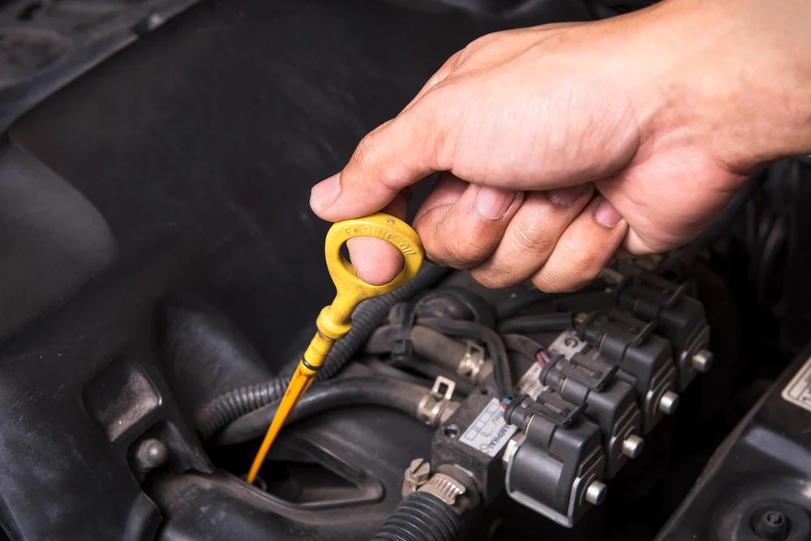
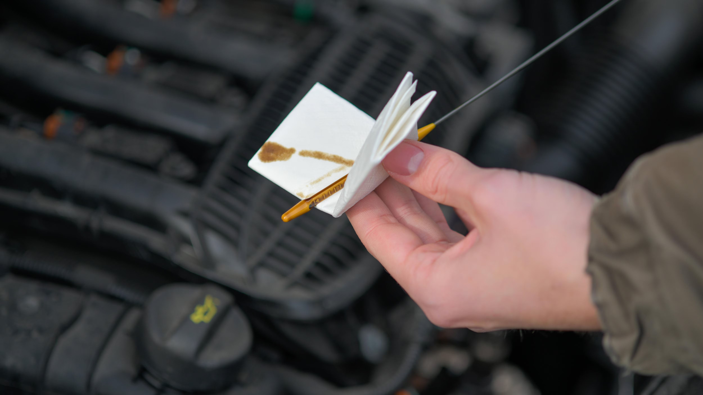
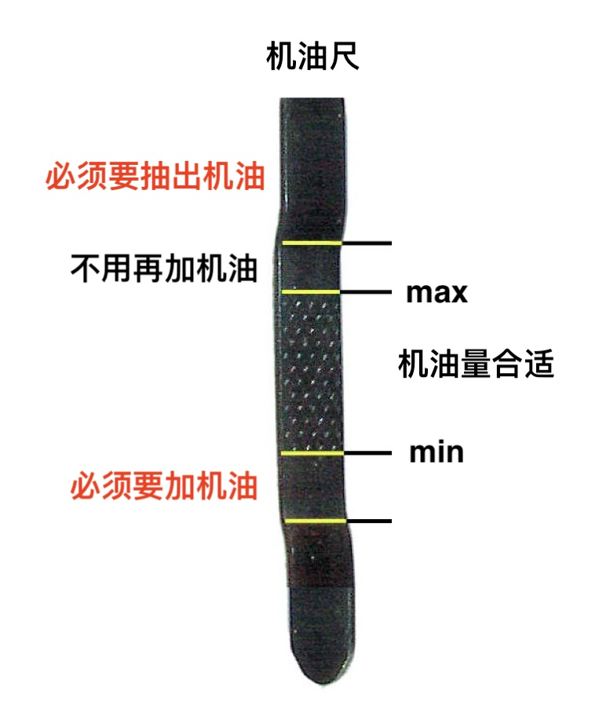
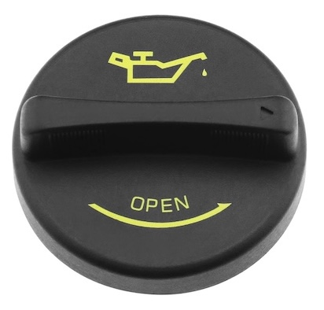
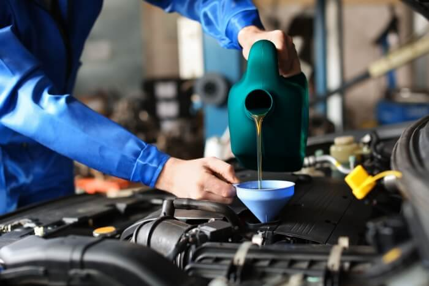
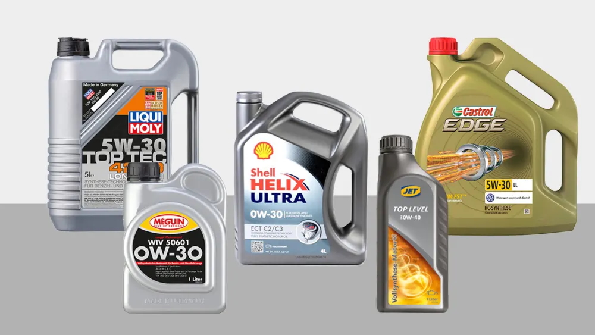

**适合在德国自驾家庭与新车主**  
（附：实用工具清单 & 常见问题解答）  

> 📅 **发布日期：2025 年 7 月 20 日**

---

## 🧭 目录

1. 引言：为什么要自己加机油  
2. 加机油前必须确认的三件事  
3. 工具准备清单  
4. 加油口与机油尺位置示意图  
5. 实操步骤详解（含提示灯判断）  
6. 加完油后如何检查与处理  
7. 常见问题解答（FAQ）  
8. 推荐品牌与购买渠道（德国本地）  
9. 延伸阅读：德国车主基础保养指南（预告）

---

## 1. 引言：为什么要自己加机油？

很多在德国生活的朋友，都会遇到以下情况：

- 仪表盘突然提示“Ölstand niedrig（机油不足）”或“Bitte maximal 1 l Öl nachfüllen（请加最多1升机油）”

- 距离下次保养还有几千公里
- 去车行不仅贵，还要预约

其实，加机油是一个**低成本、零风险且非常简单的操作**，只要准备好工具并遵循步骤，自己在家就能搞定。

---

## 2. 加机油前必须确认的三件事

在购买和添加机油之前，一定要先确认以下信息：

✅ **1）适配的机油型号（如 5W-30、0W-20）**  
查看车辆说明书，或油箱盖背后，有时会标明 VW/BMW/MB认证号，例如 VW 508 00

✅ **2）当前油量状态**  
检查机油尺油位或根据提示灯判断，是否真的需要加油

✅ **3）推荐品牌是否有特殊认证**  
德国车对机油质量要求高，建议使用有原厂认证的机油品牌，如 Liqui Moly、Castrol 等

---

## 3. 工具准备清单

你只需要以下几样东西：

| 工具 | 用途 | 备注 |
|------|------|------|
| 机油（约1L） | 添加 | 推荐德国本土品牌 |
| 漏斗 | 避免加油时溅出 | 可选 |
| 抹布/纸巾 | 擦拭机油尺 | 可重复使用 |
| 一双手套 | 防止弄脏手 | 可选 |
| 手电/手机灯 | 查看内部结构 | 视车型而定 |

---

## 4. 加油口与机油尺位置示意图

- Öleinfüllstutzen（加油口）
- Ölpeilstab（机油尺）

一般都在发动机舱靠近前侧。打开引擎盖后就能看到。

---

## 5. 实操步骤详解

### 🚗 步骤一：停车、熄火、等待

- 在平地停稳车辆，熄火  
- 等待 5~10 分钟让机油沉降

### 🧪 步骤二：检查当前油位

1. 打开引擎盖

2. 拔出机油尺

3. 用纸巾擦干净

4. 插回去再拔出 → 看油是否在Min~Max之间 

> 如果油在Min以下，说明确实需要加油。

### 🛢️ 步骤三：添加机油

1. 打开机油加注口的盖子（通常标有油壶图标）

2. 插入漏斗，慢慢添加（建议每次加100~200ml）  

3. 等几分钟 → 再次测量油位  
4. 重复直到油位接近“Max”（不要加满！）
5. 盖好机油加注口

---

## 6. 添加后如何检查

- 启动车辆 → 等1分钟 → 观察是否还有提示灯  
- 关闭引擎 → 再次检查机油尺  
- 有些车型（如BMW/Mercedes）可在车内系统中查看机油液位

---

## 7. 常见问题解答（FAQ）

| 问题 | 解答 |
|------|------|
| 如果不小心机油加多了会损坏引擎吗？ | 少量不会，但明显超过Max则必须拖去车行抽出 |
| 可以混合不同品牌机油吗？ | 一般可以，只要型号相同 |
| 多久需要加一次机油？ | 通常每1万公里或根据仪表提示 |
| 能不能去加油站让人帮忙？ | 在德国一般没人会帮你动手 |

---

## 8. 推荐品牌与购买渠道

### ✅ 品牌推荐（德国常见且靠谱）

- **Liqui Moly**（德国制造，性价比高）  
- **Castrol**  
- **Shell Helix**

### 🛒 购买渠道

- [Autodoc.de](https://www.autodoc.de)（汽车用品大站）  
- [Amazon.de](https://www.amazon.de)（方便）  
- 实体店：A.T.U、Obi、Bauhaus 等

> 提示：购买前务必确认型号 & 认证！

---

## 9. 延伸阅读（预告）

我们正在筹备以下德国车辆DIY系列：

- ✅ 《德国车主胎压检查指南》  
- ✅ 《如何添加玻璃水 + 推荐品牌》  
- ✅ 《德国车辆年检TÜV一次过指南》

欢迎关注**“德游记”**或访问我们的Gumroad主页：  
👉 [https://gumroad.com/deutschlandinsider](https://gumroad.com/deutschlandinsider)

---

## 📩 反馈与联系

如果你喜欢这份指南，欢迎评分、留言，或者通过以下方式与我联系：

- 小红书ID：德游记  
- YouTube频道：[德游记@Deutschlandinsider](https://www.youtube.com/@Deutschlandinsider)  
- 邮箱：yangkfme@gmail.com

---

## 📘 封底语

**“动手做一次，掌握一项技能。”**  
祝你成为在德国生活中更自信、更自主的车主！
