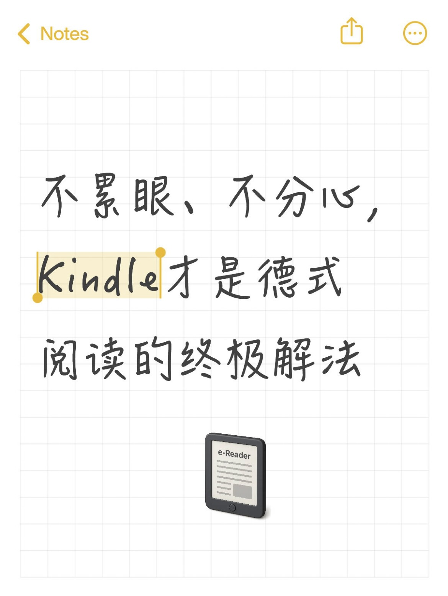
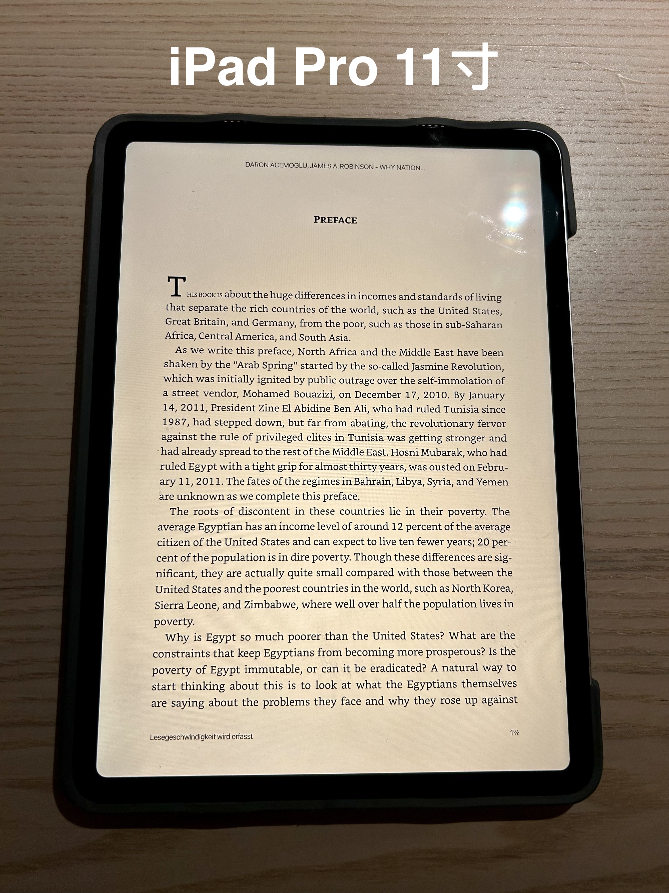
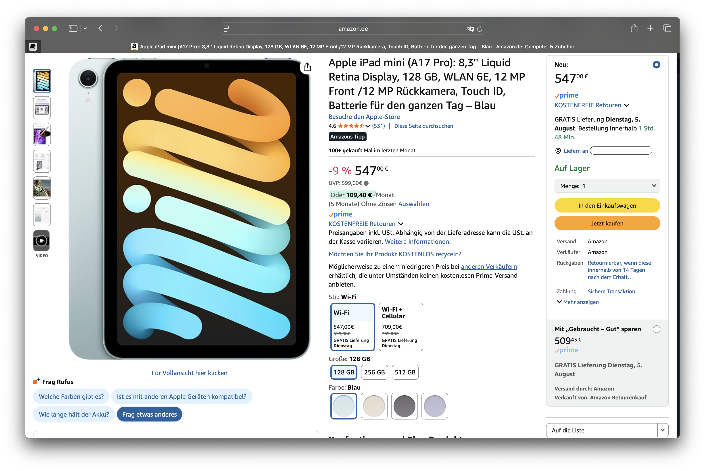
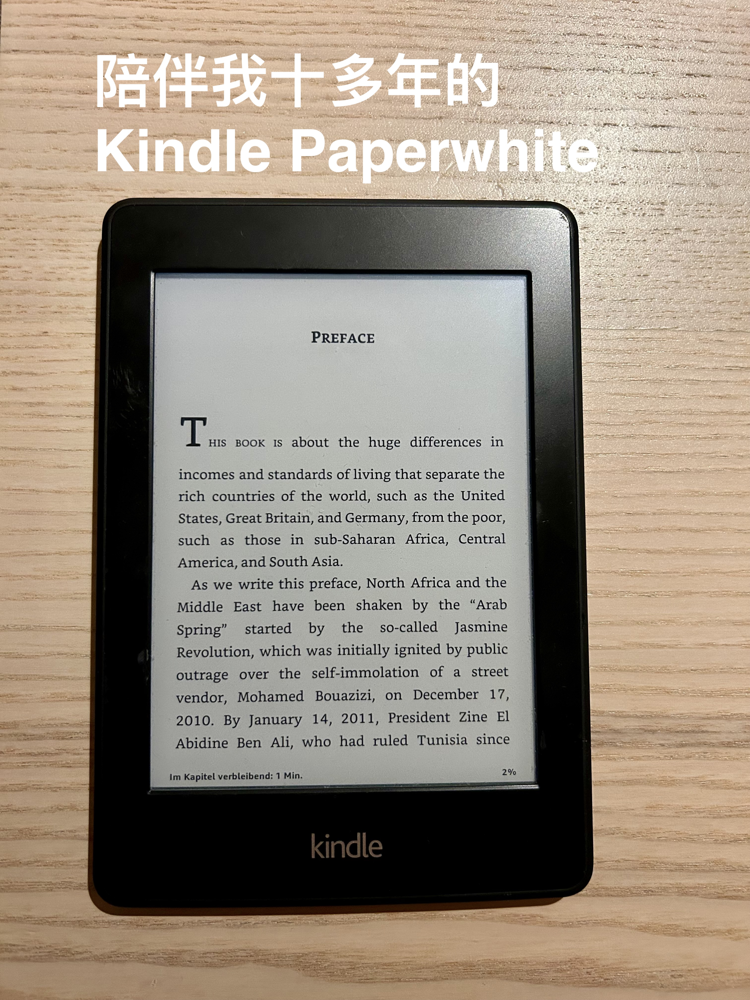
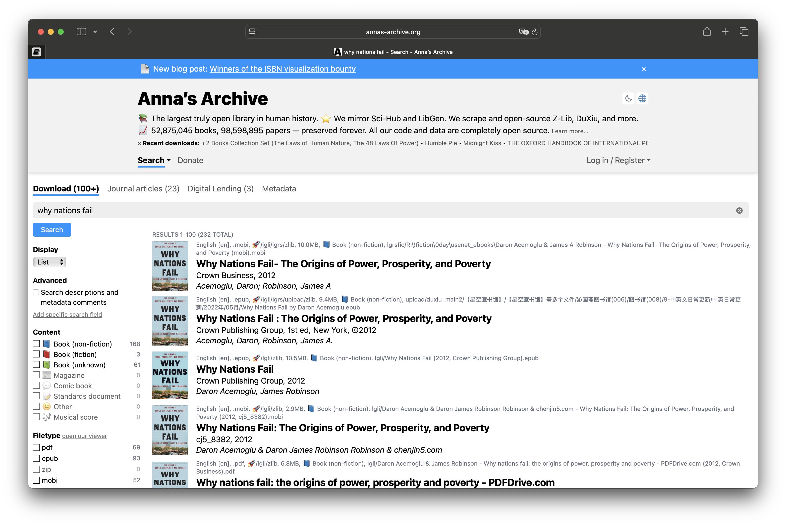
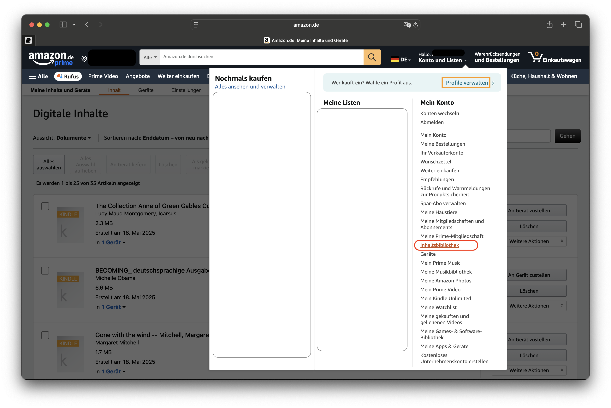
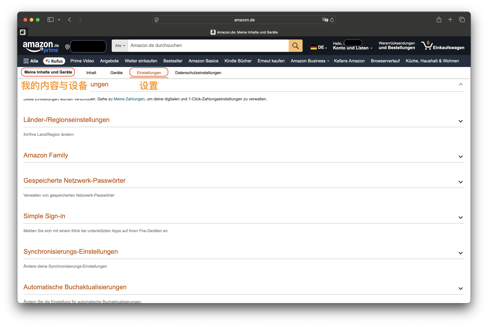
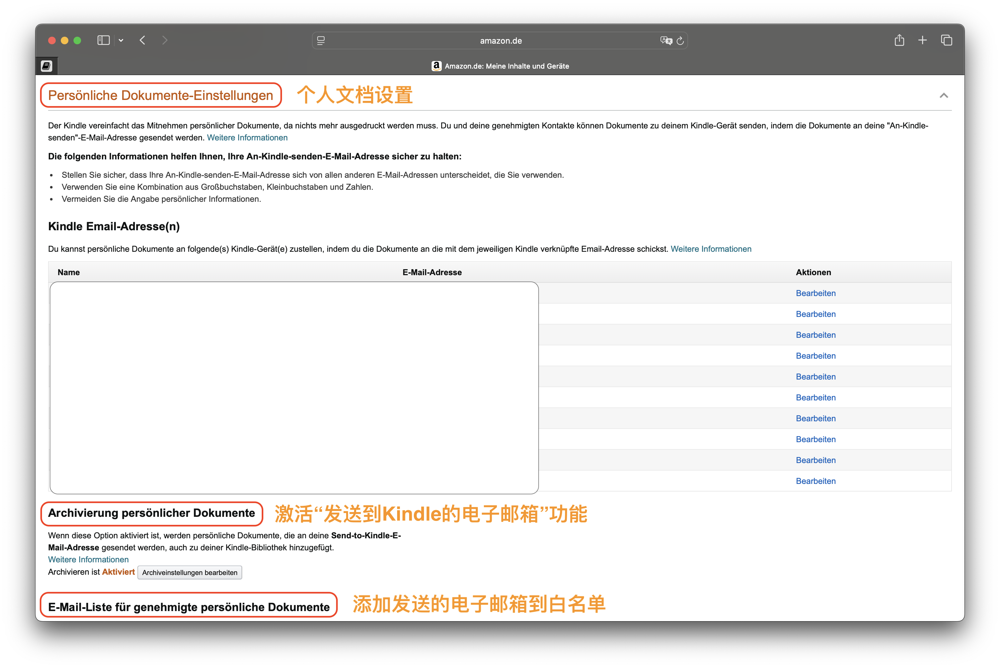
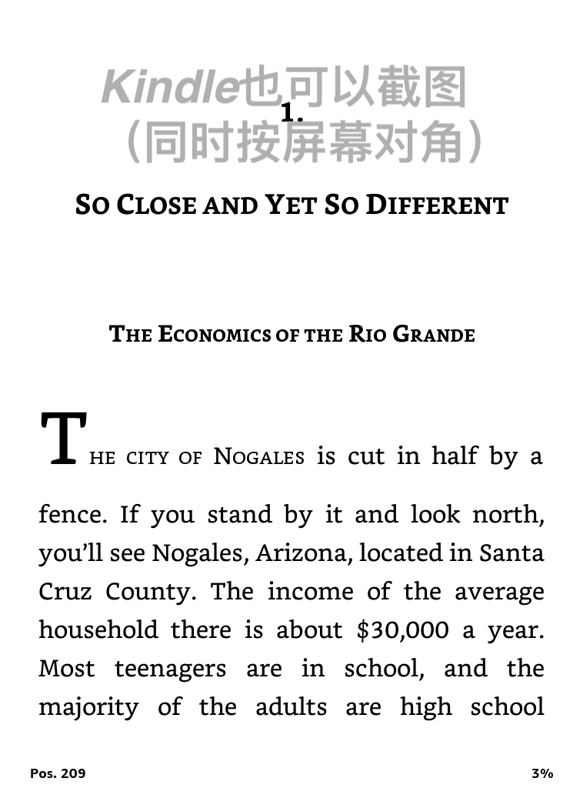
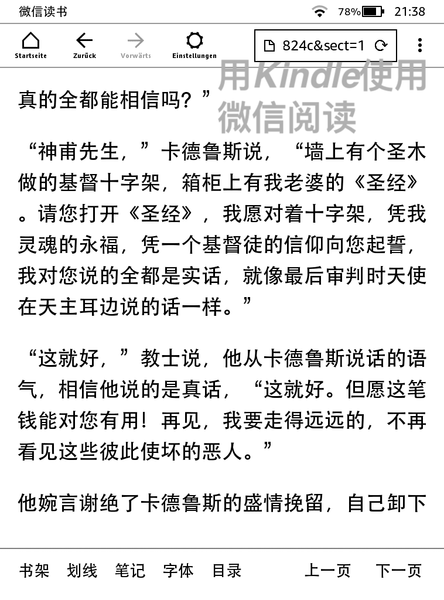

# 德国买书太贵？我这样免费看电子书

> 📅 **发布日期：2025 年 8 月 4 日**

我喜欢阅读，但为了找到一个既舒适又护眼的方式，我也走了不少弯路。

---

## 🌀 传统屏幕的困扰：眼睛酸、手臂累、注意力分散

最开始我用微信读书 App 在手机或 iPad Pro 上看书。11 寸的屏幕虽然不大，但一只手拿久了实在吃力，而且长时间盯着发光屏幕，眼睛酸胀，晚上尤其明显。更糟的是，每次通知弹出就被打断，完全无法沉浸在书的世界里。

我还考虑过入手 iPad mini ——便携、屏幕适中，看书似乎更友好。但最终还是因为价格和对眼睛不够友好而作罢。

---

## 🌱 真正适合长时间阅读的设备：Kindle

直到有一天，我把十多年前吃灰的 Kindle Paperwhite 翻出来，才意识到电子墨水屏才是真正为阅读而生的存在：

- **护眼**：电子墨水屏无背光、不伤眼  
- **超长续航**：充一次电可以用几周  
- **重量轻**：单手握持超轻松  
- **极致专注**：没有消息弹窗干扰，真正沉浸式阅读  

市面上也有墨水屏手机，但黑白显示 + 刷新慢的问题严重影响日常使用体验，而且价格不低，功能还大打折扣。

> 所以我认为：**Kindle 是通勤阅读的最佳选择。**

---

## 📬 如何把电子书轻松发送到 Kindle？

最让我惊喜的是 Kindle 的“**专属邮箱**”功能，只需三步，就能把你喜欢的电子书发送到设备中：

### 步骤 1️⃣：找资源（注意版权哦！）

比如我最近在 [Anna’s Archive](https://annas-archive.org) 找到了《为什么国家会失败》的英文 EPUB 版本。这是一个全球电子书爱好者自建的公益平台，很多老书、经典英文书都能找到。

### 步骤 2️⃣：获取你的 Kindle 邮箱

登录你的德国 Amazon 账户：

> “我的内容和设备” → “设置” → 下拉找到 “个人文档设置” → 复制你的 Kindle 邮箱地址

同时，别忘了把你常用的邮箱地址添加到“**白名单**”，否则发过去的邮件可能被拒收。

### 步骤 3️⃣：发送电子书文件

将 EPUB 文件作为附件，通过白名单中的邮箱发送到你的 Kindle 邮箱地址，几分钟后，Kindle 就能自动同步下载了。

---

---

---

## 📌 Tips

- 建议使用 **EPUB 格式**，Kindle 显示效果最佳  
- 文件发送后，Kindle **无需联网即可离线阅读**，非常适合通勤

---

## 💬 你也在德国或国外读电子书吗？

你有没有在用 Kindle，或者有什么更推荐的阅读设备？  
电子书资源你都在哪儿找？  

欢迎在评论区分享你的阅读设备与使用心得，一起交流 📖✨

---

#### #德国生活 #Kindle #电子书 #电子书阅读神器 #电子书资源
