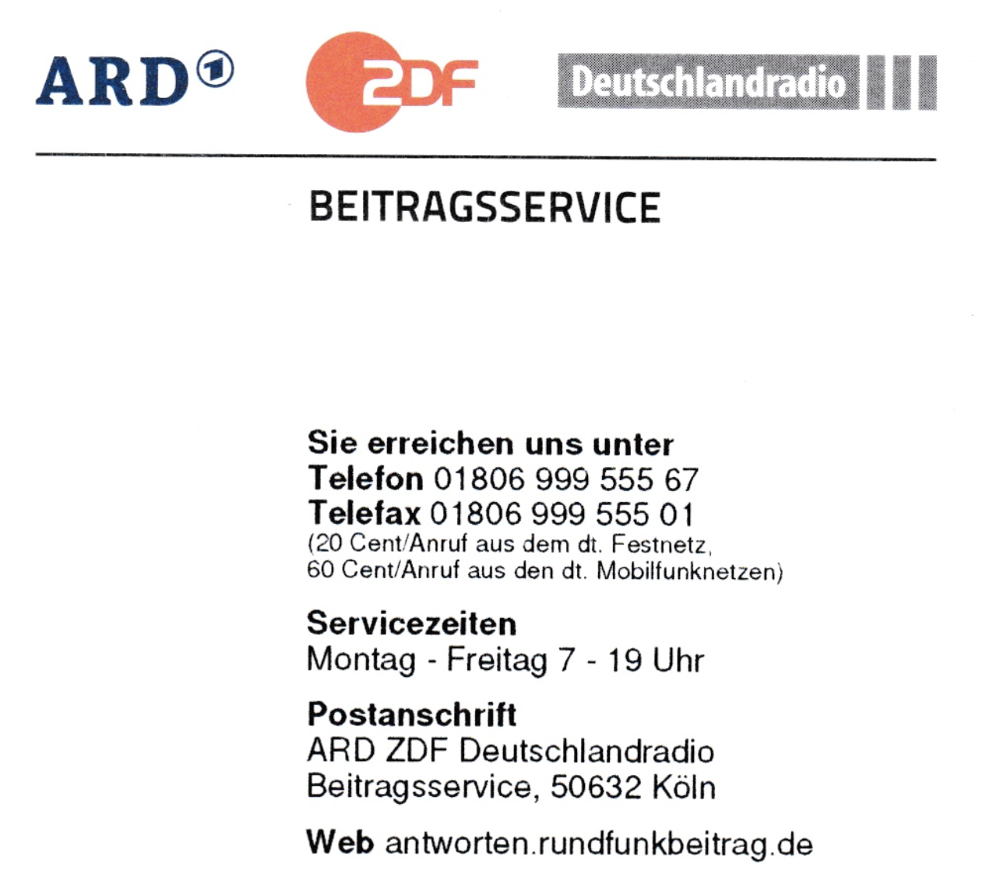

# 德国电视费不交会怎样？ 

> 📅 **发布日期：2025 年 8 月 19 日**

刚到德国，突然收到 **ARD ZDF Deutschlandradio Beitragsservice** 的信？别慌，这不是诈骗，是**公共媒体费**。不看电视也要交，因为这是为了维持 ARD、ZDF、Deutschlandradio 等公共媒体运转的**公共服务费用**。

---

## 1. 谁需要交？
- 只要在德国**有住址**，就需要交。  
- 与是否有电视/电脑/手机**无关**。  
- **按“住户/家庭”收**，不是按人头。  

---

## 2. 多少钱、怎么交？
- **18.36€/月/户**；多按**季度**扣：**55.08€**。  
- 合租（WG）只需**一人缴**，其他人挂靠，内部自行平摊。  
- 建议设置**自动转账**，省心不忘。   

---

## 3. 不交会怎样？⚠️
- 先来**提醒信（Mahnung）**  
- 继续不理 → **强制追缴+滞纳金**  
- 严重 → **法院催缴/影响信用（Schufa）**  

> **一句话总结**：逃不掉，代价高

---

## 4. 可以免/减吗？
- 经济困难（如领取救助/助学金）、重度残疾等**可申请减免**。  
- 需**主动提交材料**，直到获批前仍需正常缴。 

---

## 5. 常见误区
- ❌ “像诈骗” → **真账单**。  
- ❌ “搬家就算了” → 记得**变更地址**，否则旧址继续累积。  
- ❌ “留学生能不交吧” → 只要有住址就**必须交**。  
- ❌ “我们合租各自交一份” → **重复了**，只需一份。 

---

## 6. 实操建议
1. 收到信→尽快**注册 Beitragsnummer**。  
2. 合租先定**由谁缴费**，其余人**挂靠**。  
3. 搬家/退租**及时登记**，避免旧账尾随。  
4. 有资格减免→**立刻申请**，并保留证明。 

---

💬 **互动话题**  
你第一次看到这封信是什么反应？😅  
合租怎么分摊最省事？有成功减免的朋友吗？评论区聊聊～ 

---

#### 关键词

德国电视费、Rundfunkbeitrag、ARD ZDF、德国账单、德国生活必知、留学德国、合租WG、Schufa、Beitragsservice
