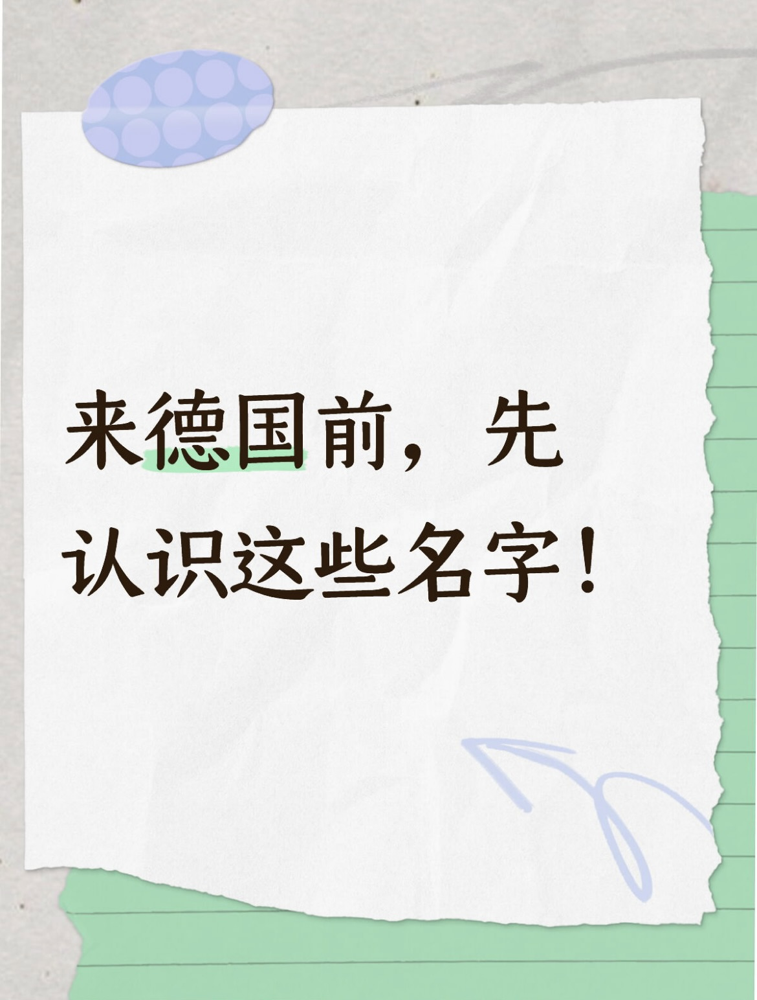

# 🇩🇪 德国名字和姓氏入门指南

> 📅 **发布日期：2025 年 8 月 21 日**

刚到德国时，我第一次听到同事叫 **“Müller（穆勒）”**，脑子里完全懵了：这是姓？是名？还是职称？😅  
其实，德国的姓氏和名字背后藏着不少门道，如果不了解，初来乍到的人很容易困惑。今天给大家一份【德国常见姓氏与名字入门指南】，少走弯路。

---

## 一、德国姓氏常见特点

### 1. 职业起源型姓氏
- **Müller**（磨坊主）  
- **Schmidt**（铁匠）  
- **Bauer**（农夫）  
> 像中国的“张”“王”“李”，非常常见。  

### 2. 地名/方位型姓氏
- **Berger**（山上的人）  
- **Bach**（溪流）  
- **Frank**（来自法兰克地区）  
> 类似中文里的“东山”“西湖”，有地理标记意味。  

### 3. 父名衍生型姓氏
- **Petersen**（Peter之子）  
- **Hansen**（Hans之子）  
> 类似英文的 Johnson。

👉 所以，当你听到德国人姓 **“Schneider（裁缝）”**，不要惊讶——那可能是他们祖先的职业。

---

## 二、德国名字的“雷区”

### 1. 性别难分
- **Sascha** 在德国是男名，但在中国很多人会以为是女生。  
- **Andrea** 在意大利是男名，但在德国却是女名。

### 2. 缩写/昵称超多
- **Johannes → Hans**  
- **Elisabeth → Lisi / Sissi**  
> 初学德语的人经常一脸懵：这是同一个人吗？

### 3. 宗教影响强
- 常见的 **Johann、Maria、Paul** 都与基督教背景相关。  
> 就像中国人里常见“建国”“小红”，反映文化烙印。

---

## 三、名字在日常中的小技巧
- **称呼要注意**：正式场合一定用 **姓氏+Herr/Frau**（如 Herr Müller / Frau Schmidt）。  
- **名字次序**：德语写法是【名 + 姓】，但文件中常全大写姓氏，例如 **Max MUSTERMANN**。  
- **避免直呼名字**：刚认识的德国人，不要直接叫名字，除非对方允许。

---

## 四、为什么中国人会觉得陌生？
- 中文姓氏集中度极高，前100个姓覆盖大多数人；德国姓氏分散，听起来很新奇。  
- 中文名通常只有2-3个字，而德国名字可能很长（如 Maximilian Alexander）。  
- 德国人喜欢多个中间名，中间名可能日常不用，但护照里一定写着。

---

## 五、给刚来德国的你几点建议
1. **提前熟悉常见姓氏**，电话和邮件会更自信。  
2. **别怕读错**，德国人习惯外国人不熟悉他们的名字。  
3. 学会问：**“Wie spricht man das aus?”（这个怎么读？）**  
> 这句话能帮你避免很多尴尬。

---

👉 为了更直观，我整理了 **德国最常见的姓氏前十** 以及 **男生、女生名字前十**，遇到这些名字时，你就不会再一脸懵啦！

## 📊 德国常见姓氏 Top 10

| 排名 | 德语姓氏 | 中文音译 | 含义/来源 |
|------|----------|----------|------------|
| 1 | Müller | 米勒 | 磨坊主 |
| 2 | Schmidt | 施密特 | 铁匠 |
| 3 | Schneider | 施奈德 | 裁缝 |
| 4 | Fischer | 费舍尔 | 渔夫 |
| 5 | Weber | 韦伯 | 织布工 |
| 6 | Meyer / Meier | 迈尔 | 管家/农场主 |
| 7 | Wagner | 瓦格纳 | 车匠 |
| 8 | Becker | 贝克尔 | 面包师 |
| 9 | Hoffmann | 霍夫曼 | 庄园管理员 |
| 10 | Schulz / Schulze | 舒尔茨 | 村长/教师 |

---

## 👨 德国男生常见名字 Top 10

| 排名 | 德语名字 | 中文音译 | 备注 |
|------|----------|----------|------|
| 1 | Maximilian | 马克西米利安 | 常见长名 |
| 2 | Alexander | 亚历山大 | 源于希腊 |
| 3 | Paul | 保罗 | 圣经名字 |
| 4 | Elias | 埃利亚斯 | 圣经名字 |
| 5 | Leon | 莱昂 | 狮子 |
| 6 | Noah | 诺亚 | 圣经人物 |
| 7 | Luis / Louis | 路易斯 | 多国常见 |
| 8 | Felix | 菲利克斯 | 意为“幸运” |
| 9 | Jonas | 约纳斯 | 圣经名字 |
| 10 | Henry / Henri | 亨利 | 古德语“家族之主” |

---
## 👩 德国女生常见名字 Top 10

| 排名 | 德语名字 | 中文音译 | 备注 |
|------|----------|----------|------|
| 1 | Emilia | 埃米莉亚 | 常见优雅女名 |
| 2 | Hanna(h) | 汉娜 | 圣经名字 |
| 3 | Sophia / Sofia | 索菲亚 | 意为“智慧” |
| 4 | Emma | 艾玛 | 德国超流行 |
| 5 | Mia | 米娅 | 短小可爱 |
| 6 | Anna | 安娜 | 永恒经典 |
| 7 | Leonie | 莱奥妮 | 意为“小狮子” |
| 8 | Marie | 玛丽 | 最常见中间名 |
| 9 | Clara / Klara | 克拉拉 | 意为“明亮” |
| 10 | Lina | 丽娜 | 简短常见 |

---

## 💡 互动话题
- 你在德国遇到过最难念的名字是什么？  
- 有没有一开始误会性别的名字？  
> 欢迎在评论区分享，大家一起涨见识！

---

#### 关键词

德国姓氏、德国名字、常见德国姓、德国人叫法、德国文化、来德国注意事项
