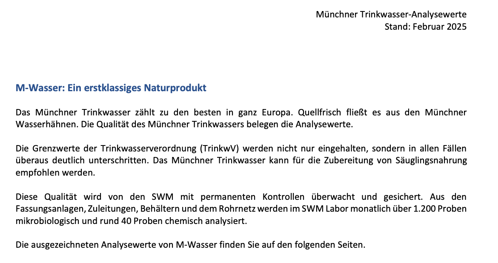
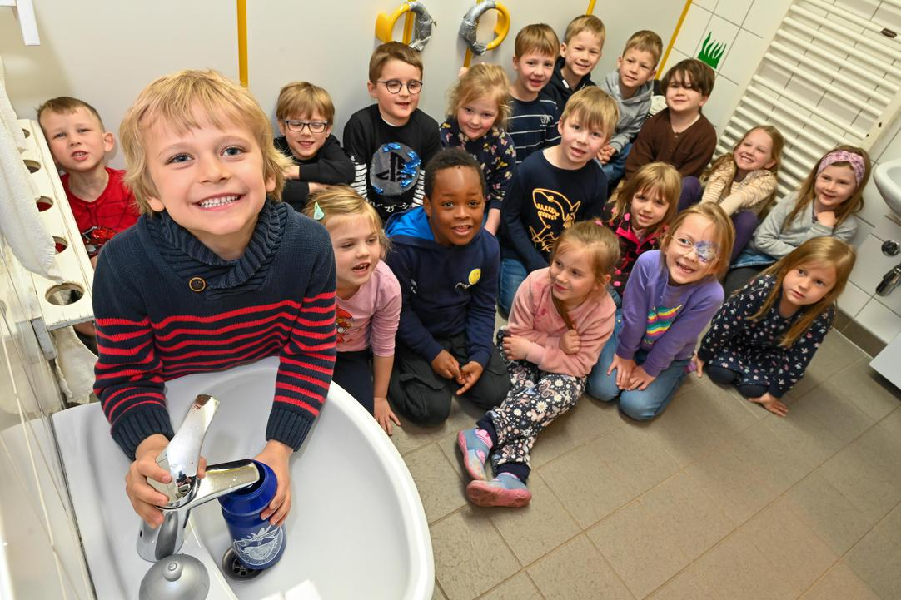

# 在德国，水龙头一拧就能喝？背后原因太震惊了！

> 📅 **发布日期：2025 年 7 月 27 日**

最近国内好几个城市爆出自来水异味、水发黄、甚至皮肤过敏的问题，不少朋友都开始重新思考一个问题：

> **我们每天喝的水，到底干不干净？**

而我在德国生活了快十年，最震惊的一件事就是：

💧 **德国人几乎人人都直接喝水龙头的水！**

## “生喝”水龙头的水？德国人真的不怕吗？

在德国，无论是家里、学校，还是政府机关、医院、办公室，大家都习惯从水龙头接水就喝，甚至直接灌水瓶带出门。

- ✅ 不烧水  
- ✅ 不装净水器  
- ✅ 不担心水质  

刚来德国的时候，我完全不能理解，甚至觉得他们太大胆了…

直到我深入了解了德国饮用水背后的“底气”，才发现：  
这不是“胆子大”，而是**制度保障 + 文化习惯**的结果。

*图：德国家里的自来水直接喝*

---

## 为什么德国人敢直接喝水龙头的水？真相有这5点：

### 1. 法规极其严格

德国有一套《饮用水条例》（**Trinkwasserverordnung**），对几百项水质指标都做了硬性规定，甚至比瓶装水标准还高。

> 不达标就要停供，责任到人，透明度极高。

---

### 2. 水源很“干净”

德国大部分饮用水来自地下水或高山泉，几乎不需要额外处理。  
天然矿物质丰富，而且基本无污染。

---

### 3. 每户水质都可查

每个城市的供水公司网站上都可以查到你家自来水的检测报告，  
包括**钙镁含量、pH值、微生物等**。

👉 完全透明，不用“猜”水质。

*图：慕尼黑水质报告截图*

---

### 4. 人们从小就习惯

孩子从幼儿园开始就用水龙头接水喝。学校、图书馆、政府部门也几乎都提供饮用水点，没人觉得自来水“low”。

*图：德国小朋友直接喝自来水*

---

### 5. 更环保、更省钱

买瓶装水在德国其实挺贵，而直接喝自来水不仅环保（减少塑料瓶），  
一年还能省下不少钱。德国人普遍对可持续生活非常重视。

---

## 我的真实体验分享

刚来德国的时候，我也不太敢直接喝，甚至还买了滤水壶。  
但后来我试着接水壶烧开，发现底部会有一层白色结晶，当时吓坏了！

结果查资料才知道，那是**钙镁矿物质**，也就是“硬水”特有的表现——  
其实是对身体有益的！

现在我早就习惯了直接喝水龙头的水，  
反而觉得德国的瓶装水太“多余”😂

---

## 你会敢直接喝水龙头的水吗？

🌍 你所在城市的水质怎么样？  
🧊 你家有没有用净水器？觉得有必要吗？

欢迎留言一起讨论！
