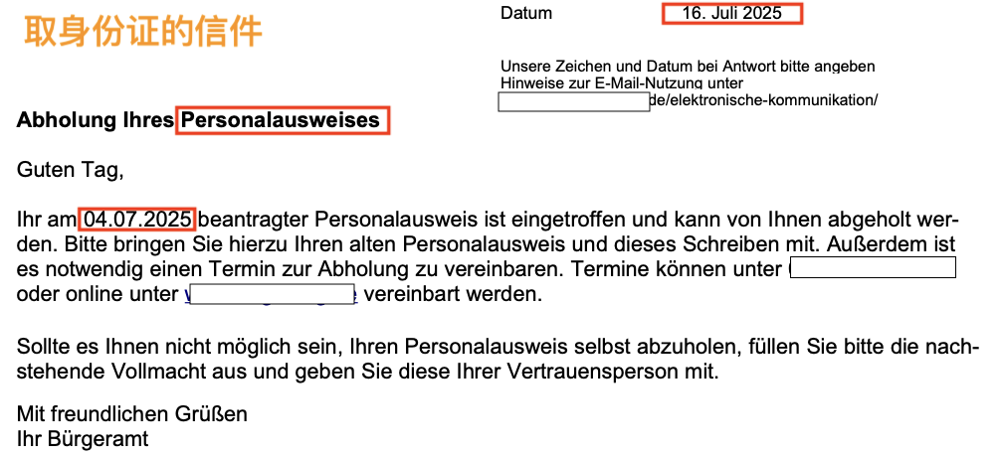
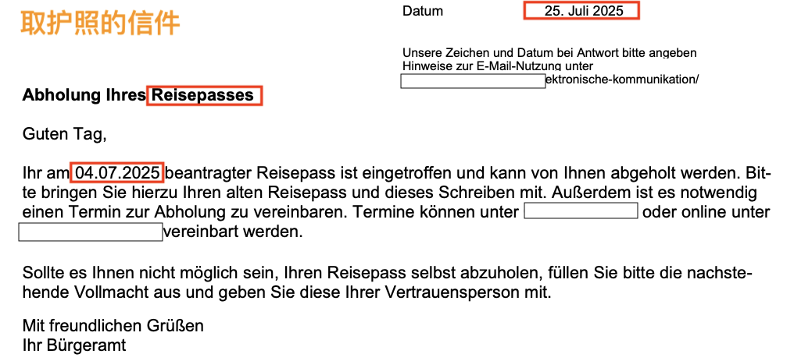
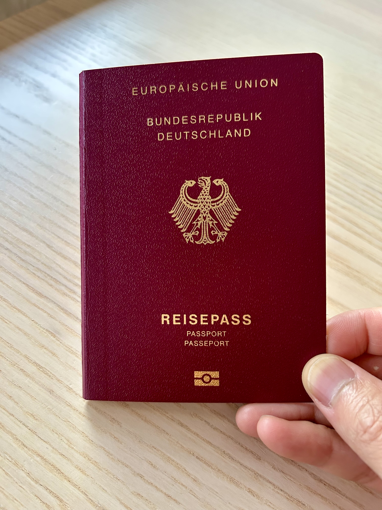

# 🇩🇪 入籍德国成功！护照身份证三周到手

> 📅 **发布日期：2025 年 8 月 2 日**

2025年7月31日，对我来说是个特别值得纪念的日子——我终于拿到了德国护照（Reisepass）和身份证（Personalausweis）🎉！

其实在 7 月 4 日领取入籍证书那一刻，整个入籍流程就算完成了——也就是入籍进度 100%。但只有真正拿到护照和身份证，才意味着一切真正尘埃落定，所以我自封这是 **“德国入籍进度 101%”**！

---

## 📝 证件申请流程 & 材料准备

入籍当天我就顺便申请了护照和身份证，流程非常简单：

### ✅ 所需材料：

- 入籍纸原件（**Einbürgerungsurkunde**）  
- 一张符合要求的电子照片二维码  

📷 **照片怎么弄？**  
现在不需要纸质照片啦！只要去合格的照相馆拍照并获取二维码即可。  
我是在 **dm店** 里拍的，现场直接打印好二维码纸，申请时出示就行，5-6 欧左右，拍得还可以。

---

## ✂️ 永居卡被剪，中国护照还在！

领取入籍纸当天，工作人员当场剪掉了我的德国 **永居卡（Niederlassungserlaubnis）** 一角 ✂️，表示作废。

但我的 **中国护照并没有被收走或盖章**。不同城市政策可能不同，建议当场确认护照处理方式 ⚠️

---

## ⏳ 证件等待时间（官方 vs 实际）

官方说：

- **身份证**：2-3 周  
- **护照**：6-8 周  

我的实际体验如下：

- 🪪 **身份证**：不到 2 周

- 🛂 **护照**：3 周出头

👉我没有加急申请，也没额外付费，**速度比预期快**。收到邮件通知后预约时间取件，**7月31日一次性全部拿到 ✅**

---

## 📦 实物感受：德国风格太“直接”了

- **身份证头像超大**，几乎占了卡片三分之一，第一次看到真有点被吓到 😅  
- **护照的照片页非常硬**，像银行卡一样厚，和封面差不多，完全不像中国护照那样是纸质页  

---

## 🗓 入籍时间线回顾

| 日期        | 事项说明                         |
|-------------|----------------------------------|
| 2024.2.2    | 提交入籍申请 & 缴费              |
| 2025.3.2    | 收到正式处理通知                 |
| 2025.3.24   | 补材料（收入、在职证明等）       |
| 2025.5.15   | 收到通知信，可预约领取证书       |
| 2025.7.4    | 领取入籍证书 + 申请证件          |
| 2025.7.31   | 护照 + 身份证全部拿到 ✅         |

---

## 📌 如果你也在申请入籍，可以参考以下我的其他笔记 👇

- 《德国入籍进度 99%》  
- 《找不到出生证明怎么办？》  
- 《德国入籍申请全流程》  
- 《三月底我补交了哪些材料？》  

---

## 📝 如果你也在等待入德国籍进度，或者想了解办理护照/身份证的经验

欢迎留言交流～也欢迎分享你的时间线 📩

---

#### #德国移民 #德国入籍 #德国护照 #德国身份证 #德漂生活 #德国生活经验 #Einbürgerung #德漂日常 #德国身份
