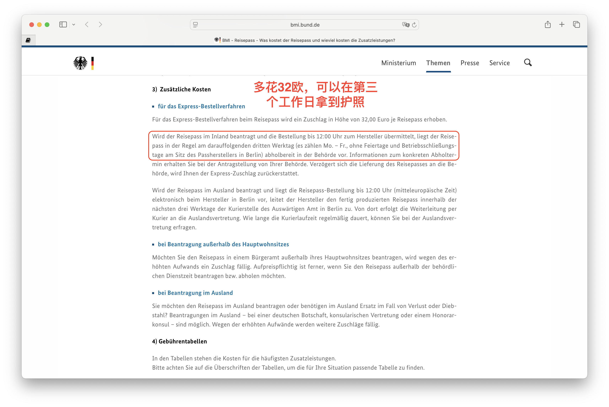

#德国入籍后必须做的5件事！

> 📅 **发布日期：2025 年 8 月 6 日**

拿到德国国籍那一刻，说实话，心里很平静。没有想象中“身份转变”的仪式感，但有几件现实的事，还是必须马上安排起来。我整理了一份「入籍后实操清单」，分享给也正在走这条路的朋友们。

---

### ✅ 1. 申请德国护照（Reisepass）和身份证（Personalausweis）

虽然你可能已经收到 Einbürgerungsurkunde（入籍证明），但只有申请了德国护照和身份证，才算是真正完成入籍流程。

- 去市政厅（Bürgeramt）预约办理，一般可以两件一起办；
- 准备好入籍证明、照片、原护照等材料；
- 正常情况下，身份证两三周到手，护照大约等 6-8 周。

📌 **建议**：如果有比较紧急的出行计划，可以加 32 欧加急办理（Express-Bestellverfahren），三个工作日可拿到。

---

### ✅ 2. 更新银行、保险、工作单位的个人信息

你的身份变了，很多后台系统也需要更新：

- 银行开户信息（特别是有涉及税务信息的）  
- 健康保险（Krankenversicherung）  
- 养老/失业保险（Rentenversicherung / Agentur für Arbeit）  
- 公司 HR 系统（避免薪资税务报错）

📌 **建议**：统一用德国身份证作为新 ID，有效避免资料混乱。

---

### ✅ 3. 考虑是否要申请「选举登记」和了解政治参与权

入籍德国后，你就正式拥有了德国公民的选举权（Wahlrecht），可以参加联邦、州、市等各级选举。特别是在地方层面，你的声音可以影响到生活成本、教育资源等民生议题。

📌 **建议**：

- 关注你所在城市的下一次选举时间（如市长、市议会）；
- 如果长期住在同一个城市，可以申请 “Wahlbenachrichtigung”（选民通知）邮寄到家中；
- 熟悉德国各党派（如 SPD、CDU、Grüne 等）的基本立场，方便投票时做选择；
- 感兴趣的话，还可以加入政党或市民组织，进一步参与公共事务。

🎯 **为什么重要**：拿到德国护照，不只是拿到旅行便利，也代表你可以真正“发声”了。这是外国人身份无法做到的事。

---

### ✅ 4. 及时更新「子女」或家庭成员的相关身份信息

如果你有孩子或配偶，他们的居留许可是依附在你身上的，那么你入籍后，他们的居留类型也可能需要更新，尤其是在以下情况下：

- 孩子是通过你获得家庭团聚的；  
- 配偶还持有居留许可；  
- 家庭成员计划未来也入籍。

📌 **建议**：入籍后尽快联系 Ausländerbehörde 咨询，是否需要重新申请他们的 Aufenthaltstitel 或调整 Aufenthaltszweck（居留目的），避免在更新签证、上学、出入境时遇到麻烦。

---

### ✅ 5. 社交生活也别忘记“同步更新”

入籍后，很多朋友第一反应是：“恭喜！要庆祝一下吗？”但也有人会问：“你以后还说自己是 🇨🇳 人吗？”这时候，不妨准备一个自己的“心路话术”。

📌 **我的建议是**：身份变了，但文化归属和生活方式依旧由你自己定义。入籍是选择一种更稳定的生活，而不是放弃过去的一切。

---

### 🎯 小结：入籍德国，不只是办个证件，更是系统切换！

建议大家在拿到入籍证明后尽早安排好护照、ID、信息更新等操作，最好 1 个月内完成，避免后续出行、报税、工作等流程出问题。

---

### 💬 你是否也已经入籍或正在考虑中？欢迎评论区交流：

- 你在入籍后最先做的事情是什么？  
- 是否感到身份认同有变化？  
- 有没有遇到“系统无法识别新国籍”的乌龙事？

**#德国生活 #德国移民 #德国入籍**
