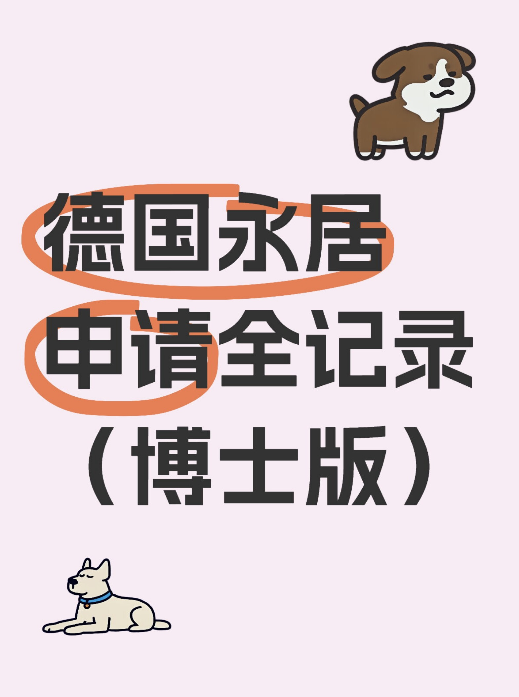

# 📍博士+普通工签5年拿德国永居经验分享

> 📅 **发布日期：2025 年 8 月 11 日**

很多人以为在德国读博、拿的又不是蓝卡，要等到天荒地老才能申请永居（Niederlassungserlaubnis）。其实只要规划好时间线，照样能按5年标准走完流程。

我就是博士+普通工作居留（Aufenthaltserlaubnis）持有人，合同短期（1–2年一续），2020年顺利拿到永居卡。今天就分享我的真实申请经验和材料清单。

---

## 1️⃣ 我的条件背景
- **身份**：岗位制博士（有雇主合同），非蓝卡  
- **社保记录**：连续缴满5年（60个月）养老保险  
- **德语**：学校B1考试成绩单（非歌德证书也可）  
- **合同**：短期雇佣合同，每年或两年续一次  

💡 **小贴士**：博士有雇主合同的工龄和社保缴费是可以算进永居申请的，不用等毕业后再开始算。

---
## 2️⃣📌 永居申请流程（博士普通工签版）

| 步骤        | 🔍 内容      | 📝 注意事项               |
| --------- | ---------- | --------------------- |
| 1️⃣ 提前预约外管局 | 在线预约面谈时间   | 热门城市需提前 3–6 个月；保存确认邮件 |
| 2️⃣ 准备材料    | 对照外管局清单    | 不同城市要求略有差异，官网可下载      |
| 3️⃣ 递交+面谈   | 当天交材料+核实信息 | 核对收入、合同、德语，无需证明未来留德意向 |
| 4️⃣ 等待制卡    | 制卡并寄送或自取   | 正常 4-6 周，我因疫情等了 4 个月 |

---
## 3️⃣📦 永居申请材料清单

| 📂 材料类别   | 🇩🇪 德文名称                    | 📌 说明                          |
| --------- | ---------------------------- | ------------------------------ |
| 📄 申请表       | Ausgefülltes Antragsformular | 官网下载并提前填写                      |
| 🛂 护照        | Reisepass                    | 有效期覆盖申请周期                      |
| 🏠 住房证明      | Wohnraumnachweis             | 租房合同                  |
| 🏥 健康保险证明    | Krankenversicherungsnachweis | 向保险公司申请 Mitgliedsbescheinigung |
| 💰 养老保险记录    | Rentenversicherungsverlauf   | 养老保险官网申请，邮寄到家                  |
| 📑 收入证明      | Einkommensnachweise          | 近 3 个月工资单 + 合同   |
| 🎓 德语证书      | B1 Zertifikat                | 歌德、telc 或大学 B1 考试成绩单           |
| 📜 融合课程证书（选） | Integrationskurs-Zertifikat  | 无则需合理解释                        |
| 📧 联系方式声明（选） | Einverständniserklärung      | 同意保存电话和邮箱                      |

---

## 4️⃣ 我的申请心得
- **能算工龄的博士身份很宝贵**：别傻傻等毕业，工龄是按你缴纳社保的时间算的。  
- **德语越早搞定越好**：有B1不仅是永居门槛，以后入籍也用得上。  
- **合同短期不是障碍**：只要收入稳定、社保正常，永居申请不受影响。  
- **材料要提前确认**：不同城市的外管局细则会有差异，比如有的还要银行流水或税单。  
- **预约尽早抢**：有城市预约一放就秒光。

---

💬 **互动区**  
你是博士还是蓝卡党？你打算什么时候申请永居？评论区聊聊你的条件，我帮你看看能不能提前申请 👇

---

🔍 **关键词**  
德国永居、博士永居申请、德国工作居留、Niederlassungserlaubnis、德国移民法、蓝卡与普通工签区别、B1德语要求、德国养老保险、德国外管局预约

