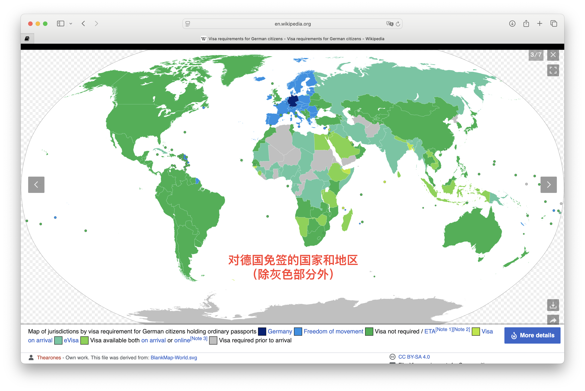

# 德国永居 vs 入籍：我都拿过，说说真实感受！

> 📅 **发布日期：2025 年 8 月 8 日**

---

## ✨我的背景：从永居到入籍的亲历  
我是在2015年以工作签证来德国读岗位制**博士**（Promotionsstelle）的，五年后我顺利拿到了**德国永居**。  
本以为可以安稳生活下去，但随着出差增多，我开始真正思考“入籍”这件事。今年7月，我正式拿到了**德国护照**。

---

## 🟢德国永居（Niederlassungserlaubnis）  
✅ 优点：  
- 保留中国国籍，对身份认同没有太大割裂  
- 不需要续签，换中国护照后只需更新德国居留卡即可  
- 申请相对容易，特别是有**欧盟蓝卡**或**德国蓝卡**、长期工作记录或博士经历的人  
- 在**德国生活**没有限制，社保、工作、医保、买房贷款都一样享受  

❗不足：  
- 去英国🇬🇧、爱尔兰🇮🇪、日本🇯🇵等国仍需签证，手续复杂  
- 没有选举权，也不能担任某些公务职位  
- 长期离境德国容易导致身份失效（回国几年可能就得重新申请）  

📌适合人群：希望在德国长期生活但仍想保留中国国籍的朋友。

---

## 🔵德国入籍（Einbürgerung）  
✅ 优点：  
- 德国护照含金量高，全球190+国家/地区**免签**，出差、旅行非常方便  
- 有选举权和被选举权，政治参与感更强  
- 更容易获得社会认同，在租房、求职、贷款等方面更具优势  
- 回国依然可以申请长期居留，例如探亲、工作或养老  

❗不足：  
- 必须放弃中国国籍（中国不承认双国籍）  
- 心理门槛高，尤其是对于“身份认同”敏感的人  
- 办护照涉及更多手续，审核周期也较长  

📌适合人群：频繁出差、有家庭/**孩子规划**，或打算深耕**德国生活**的人。

---

## 🤔我的真实选择与思考  
我拿永居时其实挺满足的，直到工作需要去英国🇬🇧和爱尔兰🇮🇪出差——就算已经有签证，还是常被海关盘问，得出示回程机票、酒店订单、跟客户往来邮件等资料。  
后来那张两年多次英国签证过期了，我真的不想再折腾一遍材料申请。  
那时我意识到——德国护照带来的“方便”真的很值钱，尤其是出差常要跑欧洲以外国家的。最终，我决定入籍。

---
## 🇩🇪德国永居 vs 入籍｜优缺点一表看懂 

| 项目           | 🇩🇪 德国永居（Niederlassungserlaubnis）       | 🛂 德国入籍（Einbürgerung）                |
|----------------|----------------------------------------------|--------------------------------------------|
| ✅ 国籍保留    | ✅ 保留中国国籍                              | ❌ 放弃中国国籍                            |
| 📍 居留稳定性  | ✅ 长期有效，不用续签                        | ✅ 永久有效，不用再换居留卡                |
| 🌍 出入境便利  | ❌ 多国仍需签证（如英、日、爱尔兰等）       | ✅ 护照免签190+国家/地区                   |
| 🗳️ 社会参与机会| ❌ 无法参与地方投票、公务岗位等               | ✅ 可参与社会事务，表达意见                |
| 💼 生活便利度  | ✅ 正常生活、工作、医保、买房无影响           | ✅ 同上，部分场景更便利                    |
| 🧳 长期离境限制| ❗ 离境太久可能失效                          | ✅ 护照不受影响，回德更自由                |
| 👨‍👩‍👧‍👦 家庭连贯性 | ✅ 子女如出生在德也有入籍选择                 | ✅ 子女多自动获得德国国籍                  |
| 💡 申请难度    | ⭐ 相对简单，特别是蓝卡/博士背景              | ⭐⭐ 材料多，审核周期长                     |
| 🤔 适合人群    | 想保留中国身份、回国发展的朋友               | 经常出差、长期定居德国的人                 |

---

## 🗣️你怎么看？欢迎评论区聊聊！  
- 💬 你现在是德国永居，还是打算入籍？  
- 💬 你最担心的点是什么？我可以分享更多经验~
